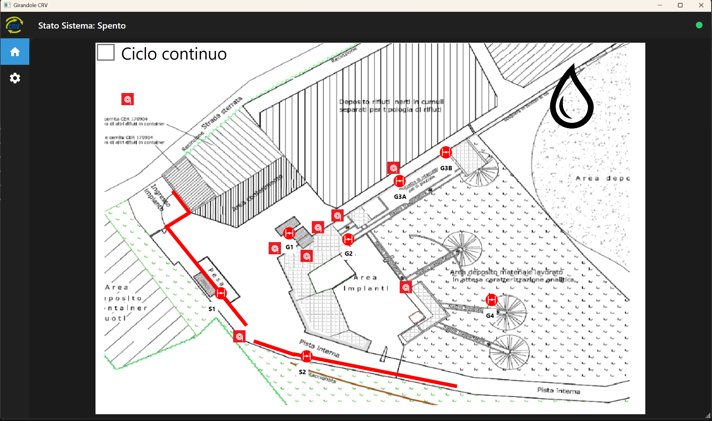
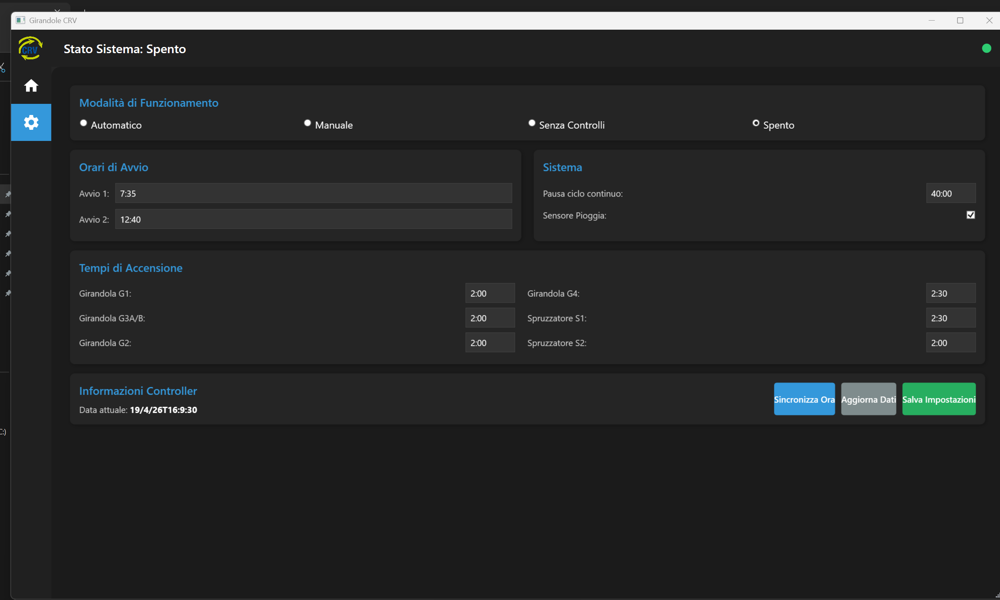

# GirandoleCRV

Sistema di controllo automatico per l'irrigazione dell'impianto CRV. Il progetto è composto da due parti: un firmware per il controller hardware **Controllino MAXI** e un'applicazione desktop **WPF** per la gestione e il monitoraggio remoto.

---

## Compatibilità con il sistema preesistente

L'impianto CRV disponeva già di una gestione manuale fisica (quadro elettrico, deviatori, cablaggio) prima dell'introduzione di questo software. Il Controllino è stato inserito **a fianco** di quella gestione, non in sostituzione. Questo ha imposto una serie di scelte progettuali non convenzionali che altrimenti risulterebbero difficili da spiegare leggendo il codice.

---

## Schermate dell'applicazione

| Schermata principale | Impostazioni |
|---|---|
|  |  |

La schermata principale mostra la planimetria dell'impianto con lo stato in tempo reale di tutte le valvole e degli spruzzatori. La schermata delle impostazioni permette di configurare modalità operative, orari di avvio e durate di irrigazione.

---

## Architettura del sistema

```
┌─────────────────────┐         TCP/IP (porta 23)        ┌──────────────────────────┐
│   GUI WPF (C#)      │  ──────────────────────────────▶  │   Controllino MAXI       │
│   Windows           │  ◀──────────────────────────────  │   Arduino (Socket.ino)   │
│                     │       JSON di risposta             │   IP: 192.168.178.254    │
└─────────────────────┘                                   └──────────┬───────────────┘
                                                                     │ Relè digitali
                                                          ┌──────────▼───────────────┐
                                                          │  Elettrovalvole + Pompa  │
                                                          │  Girandole G1–G4         │
                                                          │  Spruzzatori S1–S2       │
                                                          │  Idrante                 │
                                                          └──────────────────────────┘
```

La GUI non contiene logica di controllo: si limita a inviare comandi testuali al controller e a visualizzare lo stato ricevuto. Tutta la logica (scheduler, ciclo continuo, gestione pompa, fascia oraria) risiede nel firmware del Controllino.

---

## Componenti hardware

| Componente | Descrizione |
|---|---|
| **Controllino MAXI** | PLC compatibile Arduino con Ethernet integrata, orologio RTC e uscite a relè |
| **Elettrovalvole G1–G4** | Girandole di irrigazione nelle diverse zone dell'impianto |
| **Spruzzatori S1–S2** | Spruzzatori su rampa e piano (con relè a logica invertita) |
| **Idrante** | Controllo manuale della pompa tramite deviatore R6/R7 |
| **Sensore pioggia** | Ingresso digitale A0; se attivo, blocca l'irrigazione automatica |

---

## Firmware Arduino — `Arduino/Socket/Socket.ino`

Il firmware gira sul Controllino MAXI e svolge le seguenti funzioni:

### Server TCP
Apre un server TCP sulla porta `23`. Ad ogni connessione legge un comando, lo esegue e (se richiesto) invia la risposta JSON.

### Protocollo comandi

| Comando | Esempio | Descrizione |
|---|---|---|
| `GET_ALL` | `GET_ALL:AAA;` | Restituisce stato valvole + impostazioni in JSON |
| `GET_DATE` | `GET_DATE:AAA;` | Restituisce la data/ora corrente del RTC |
| `SET_DATE` | `SET_DATE:Apr 19 2026-10:30:00;` | Sincronizza il RTC |
| `MANUAL_CONTROL` | `MANUAL_CONTROL:2=ON;` | Apre/chiude una valvola manualmente |
| `MANUAL_CONTROL` | `MANUAL_CONTROL:IDR=ON;` | Attiva/disattiva l'idrante |
| `SET_PARAM` | `SET_PARAM:MODE#1;` | Modifica un parametro di configurazione |
| `STORE_CHANGES` | `STORE_CHANGES:AAA;` | Salva le impostazioni in EEPROM |
| `CONTINUOS_CYCLE` | `CONTINUOS_CYCLE:ON;` | Avvia/ferma il ciclo continuo |

### Modalità operative

| Codice | Nome | Comportamento |
|---|---|---|
| `1` | Automatico | Lo scheduler avvia l'irrigazione agli orari configurati; fuori fascia oraria e nei weekend le valvole vengono forzate spente |
| `2` | Manuale | Il controllo manuale dalla GUI è abilitato, ma la fascia oraria rimane attiva |
| `3` | Senza Controlli | Il controllo manuale funziona senza restrizioni di orario o giorno |
| `4` | Spento | Tutte le valvole vengono spente; nessuna operazione automatica o manuale |

### Scheduler automatico
Lo scheduler confronta ogni 20 secondi l'ora del RTC con due orari configurabili (default `07:00` e `12:30`). Quando coincidono, attiva le valvole in sequenza (`G4 → G3 → G1 → G4 → G2 → G1`) per la durata impostata per ciascuna, poi spegne tutto.

### Ciclo continuo
Il ciclo continuo percorre la stessa sequenza di valvole ripetutamente, con una pausa configurabile tra un ciclo e il successivo. Si usa per irrigazioni prolungate.

### Gestione pompa
La pompa è controllata tramite un deviatore su due relè (R6 = manuale, R7 = PLC). Il firmware accende la pompa solo quando almeno una valvola che la richiede è aperta, e la spegne con un ritardo di 2 secondi per evitare colpi d'ariete.

### Persistenza (EEPROM)
Modalità, orari di avvio, durate di irrigazione e stato del sensore pioggia sono salvati in EEPROM e ripristinati al riavvio del controller.

---

## Applicazione GUI — `GUI/`

Applicazione desktop **WPF** (.NET 6, Windows) con architettura **MVVM**.

### Struttura del codice

```
GUI/
└── GUI/
    ├── Core/
    │   ├── SocketClient.cs       # Client TCP asincrono verso il Controllino
    │   ├── ObservableObject.cs   # Base per INotifyPropertyChanged
    │   └── RelayCommand.cs       # Implementazione ICommand
    ├── MVVM/
    │   ├── Model/
    │   │   └── DataTransfer.cs   # Modelli per deserializzare il JSON del controller
    │   ├── View/
    │   │   ├── HomeView.xaml     # Vista con planimetria e controlli valvole
    │   │   └── SettingsView.xaml # Vista configurazione
    │   └── ViewModel/
    │       ├── HomeViewModel.cs  # Logica della schermata principale
    │       ├── SettingsViewModel.cs # Logica della schermata impostazioni
    │       └── MainViewModel.cs  # Navigazione tra le viste
    └── MainWindow.xaml           # Finestra principale con barra di navigazione
```

### Flusso dati

1. `HomeViewModel` e `SettingsViewModel` chiamano `SocketClient.ExecuteCommandAsync()` per comunicare col Controllino.
2. `SocketClient` apre una connessione TCP, invia il comando e (se previsto) legge la risposta entro un timeout di 5 secondi.
3. La risposta JSON viene deserializzata tramite `DataTransfer` e le proprietà del ViewModel vengono aggiornate.
4. WPF riflette automaticamente i cambiamenti nell'interfaccia tramite data binding.
5. La schermata principale si aggiorna automaticamente ogni **20 secondi**.

### Schermata principale (Home)
- Planimetria dell'impianto con le valvole rappresentate come checkbox sovrapposte alla mappa.
- Toggle per ciascuna valvola (G1, G2, G3A/B, G4, S1, S2) e per l'idrante.
- Pulsante **Ciclo continuo** per avviare/fermare il ciclo automatico.
- Indicatore del sensore pioggia (goccia blu = pioggia rilevata).

### Schermata impostazioni (Settings)
- Selezione della modalità operativa (Automatico / Manuale / Senza Controlli / Spento).
- Configurazione dei due orari di avvio giornalieri.
- Durata di irrigazione per ogni zona (formato `mm:ss`).
- Pausa del ciclo continuo e attivazione del sensore pioggia.
- Pulsanti: **Sincronizza Ora** (invia l'ora del PC al RTC), **Aggiorna Dati** (rilegge dal controller), **Salva Impostazioni** (invia tutti i parametri e li persiste in EEPROM).

---

## Configurazione di rete

Per default la GUI si connette all'indirizzo:

```
IP:   192.168.178.254
Porta: 23
```

L'indirizzo è modificabile tramite le proprietà `SocketClient.ServerIp` e `SocketClient.ServerPort`.

---

## Requisiti

### Controller
- Controllino MAXI
- Librerie Arduino: `Ethernet`, `SPI`, `Controllino`, `EEPROM`

### GUI
- Windows 10/11
- .NET 6 (Windows)
- NuGet: `Newtonsoft.Json`
